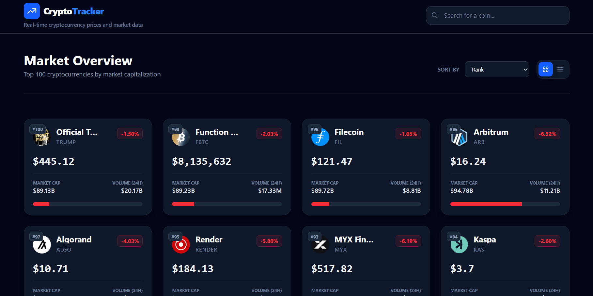

# 🚀 Crypto Tracker

A modern and responsive **Crypto Tracker application** built using **React.js**.  
This app allows users to track real-time cryptocurrency prices, market trends, and key statistics in a clean and user-friendly interface.

---

## ✨ Features

- 📊 Real-time cryptocurrency prices  
- 🔍 Search for specific cryptocurrencies  
- 📈 Market data like price, volume, and market cap  
- 🌙 Clean and responsive UI  
- ⚡ Fast and optimized React components  

---

## 🛠 Tech Stack

- **Frontend:** React.js  
- **Styling:** CSS / Tailwind CSS (if used)  
- **API:** Public Crypto API (e.g. CoinGecko) 

## 📸 Screenshots

## Clone the repository
git clone https://github.com/your-username/react-crypto-tracker.git

## Navigate to the project directory
cd react-crypto-tracker

## Install dependencies
npm install

## Start the development server
npm start

http://localhost:5173